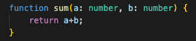
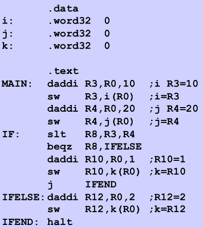
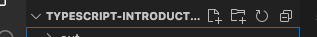

# introducción a la programación


1. ¿Qué es un lenguaje de programación?
      
    Es una forma de comunicarse con un dispositivo como un ordenador, movil, etc.
        
    Básicamente se dividen en dos tipos:
    - Lenguajes de alto nivel
        - Java
        - C#
        - C++
        - TypeScript
    - Lenguajes de bajo nivel
        - Lenguaje ensamblador
        - Lenguaje máquina

    Los lenguajes de alto nivel son más cercanos al lenguaje natural de los seres humanos y los de bajo nivel son más cercanos al lenguaje de las máquinas.

    1.1 ¿Qué es el lenguaje máquina?
    
    Es un sistema de códigos directamente interpretado por un microprocesador. Como sistema de código nos referimos al sistema binario. El sistema binario es un sistema de enumeración donde únicamente utiliza dos cifras (0) y (1).

    - **Ejemplo lenguaje de alto nivel (typescript)**
    
    
    
    - **Ejemplo lenguaje de bajo nivel (ensamblador)**
    
    
    
    1.2 ¿Lenguajes compilados o interpretados?

    - **Los lenguajes compilados** como C++ son traducidos directamente al lenguaje máquina.

    - **Los lenguajes interpretados** como javascript son traducidos a lenguaje máquina a través de un interprete como **node** en tiempo de ejecución.

    > Java es un lenguaje de alto nivel, compilado y interpretado.

    1.3 Paradigmas de los lenguajes de programación

    - Programación estructurada: Es un paradigma de la programación donde el código es organizado en subrutinas/funciones utilizando únicamente tres estructuras: secuencia, condicional e iteración.
  
    - Programación orientada a objetos: Es un paradigma de la programación donde el código es organizado en unidades domindas  clases, de las cuales se crean objetos que se relacionan entre si para conseguir los objetivos de la aplicación. Es decir, intenta evitar tener un código con pura lógica y de esta manera estructurar mejor nuestro dominio en clases.
  
    - Programación reactiva: Es un paradigma de la programación donde el código representa flujos de datos asíncronos y reaccionan a sus cambios.
  
    - Programación funcional: Es un paradigma de la programación donde el código es organizado en funciones.

    1.4 Programación imperativa vs declarativa

    - Programación imperativa: se centra en "cómo" debemos de crear un algoritmo para lograr un objetivo.
      ```
        export function find(value: number, values: number []): number {
            let item: number | undefined

            for(let i = 0; i <= values.length; i+=1) {
                if(values[i] === value) {
                    item = values[i]
                    break
                }
            }

            return item
        }
      ```

    - Programación declarativa: se centra en "qué" debemos de hacer en un algoritmo para lograr un objetivo.
    
        ```
        export function find2(value: number, values: number []): number {
            return values.find((item) => item === value)
        }
        ```


2. ¿Librería o Framework?

    - Una librería es un conjunto de módulos/piezas que solucionan un problema en concreto. Por ejemplo, [MomentJS](https://momentjs.com/) es una librería que permite un mejor manejo de fechas/tiempos en JavaScript.
  
    - Un framework es un marco de trabajo donde nos indica como tenemos que trabajar con él. Por ejemplo, [Angular](https://angular.io/) es un framework de front donde permite crear aplicaciones web relativamente rápido. Establece un marco de trabajo, es decir, indica como tenemos que desarrollar nuestra aplicación.

3. ¿Qué es node?

    Es un entorno en tiempo de ejecución multiplataforma. Para ser más claros, permite la ejecución del código JavaScript en cualquier entorno multiplataforma.

4. ¿Qué es JavaScript?

    Es un lenguaje de programación de alto nivel interpretado, debilmente tipado y dinámico. Basado en la especificación de ECMAScript.

    ECMAScript es un estánder de [ecma-international](ecma-international) que define como crear un lenguaje de scripting.

5. ¿Qué es TypeScript?

    Es un lenguaje de programación de alto nivel interpretado. Además de ser un "superset" de JavaScript, es decir, una mejor versión de JavaScript que añade tipado estático y objetos basados en clase.

6. ¿Qué es Visual Studio Code?

    Es un entorno de desarrollo que permite editar un código fuente.

7. Antes de empezar

    7.1 Instalar [Node](https://nodejs.org/es/) interprete de JavaScript.

    7.2 Instalar TypeScript con `npm install -g typescript` en nuestra terminal.

    7.3 Instalar [Visual studio code](https://code.visualstudio.com/download) IDE para el desarrollo del código.

8. Nuestro primer "Hola mundo"

    8.1 Abrimos el terminal y ejecutamos `mkdir typescript-hello-world` para crear una carpeta para el proyecto.

    8.2 Abrimos Visual Studio code y en las opciones `archivo` -> `abrir carpeta` seleccionamos la carpeta que acabamos de crear.

    8.3 Creamos un nuevo fichero llamado `helloWorld.ts` desde el menú.
    

    8.4 Añadimos nuestro primer "Hola mundo" en el fichero `helloWorld.ts`
    ```    
    const helloWorld  = "Hello world"
    console.log(helloWorld)
    ```

    8.5 Compilamos/transpilamos código TypeScript a JavaScript con el siguiente comando en nuestra terminal `tsc *.ts`. El resultado es un fichero `helloWorld.js`.

    8.6 Ejecutamos nuestro código con `node helloWorld.js`

9.  Estructurar mejor nuestro código

    Nuestro objetivo será automatizar las compilaciones y poder ejecutar los tests.

    9.1 En el directorio de nuestro proyecto creamos un fichero llamado `tsconfig.json` con el siguiente contenido:
    ```
    {
        "compilerOptions": {"outDir": "out", "esModuleInterop": true},
        "include": ["src/*", "jest.config.js"]
    }
    ```

    9.2 Creamos una carpeta llamada `src` y movemos el fichero `helloWorld.ts` al directorio `src`.

    9.3 Instalamos `jest` con el siguiente comando `npm i jest @types/jest ts-jest typescript -D` en el directorio de nuestro proyecto.

    9.4 Creamos un fichero de configuración llamando `jest.config.js` en la raíz del proyecto con el siguiente contenido:
    ```
    module.exports = {
            "roots": [
            "<rootDir>/src"
            ],
            "testMatch": [
            "**/__tests__/**/*.+(ts|tsx|js)",
            "**/?(*.)+(spec|test).+(ts|tsx|js)"
            ],
            "transform": {
            "^.+\\.(ts|tsx)$": "ts-jest"
            },
            "bail": false
    }
    ```

    9.5 Nuestro fichero `package.json` debería de tener el siguiente aspecto:
    ```
    {
        "devDependencies": {
            "@types/jest": "^29.0.3",
            "jest": "^29.0.3",
            "ts-jest": "^29.0.1",
            "typescript": "^4.8.3"
        },
        "scripts": {
            "test": "jest"
        }
    }
    ```

    9.6 Abrimos una nueva terminal en Visual Studio Code y ejecutamos el siguiente comando `tsc -w`.

10.  Pequeño repaso a TypeScript

```
    // tipo de datos

    let age: number
    let title: string
    let isEasy: boolean
    let user: { name: string, surname: string }
    let nothing: undefined
    let nullValue: null
    let multipleValue: string | number
    let array: string[]
    let sum: (a: number, b: number) => number
    let anything: any

    const a: number = 1

    // funciones
    export function complexFunction() {

        const name: string = "Tote"

        function internalFunction(): void {
            console.log(`Call from internal function ${name}`)
        }

        internalFunction()
    }

    export function minus(a: number, b: number): number {
        return a - b
    }

    export function toDoSomthing(a: number, b: number): void {
        console.log(a + b)
    }

    export function defaultParameter(a: number, b: number = 2): void {
        console.log(a + b)
    }

    // funcion de órden superior
    export function transform(value: number, operation: (value: number) => number): number {
        return operation(value)
    }

    export const anonymousFunction = function () {
        console.log("Welcome to Introduction!");
    }

    // funcion de primera clase
    export const anonymousFunction2 = function (name) {
        console.log(`Welcome ${name} to Introduction!`);
    }

    // funcion de primera clase
    export const anonymousArrowFunction = () => {
        console.log("Welcome to Introduction!");
    }

    // funcion de primera clase
    export const anonymousArrowFunction2 = (name) => {
        console.log(`Welcome ${name} to Introduction!`);
    }

    // estructuras de control

    export function isGreaterThan(value: number, isGreaterThan: number) {
        if (value > isGreaterThan) {
            return true
        } else {
            return false
        }
    }

    export function isBetween(value: number, start: number, end: number) {
        if (value >= start && value <= end) {
            return true
        } else {
            return false
        }
    }

    export function find(value: number, values: number []): number {
        let item: number | undefined

        for(let i = 0; i <= values.length; i+=1) {
            if(values[i] === value) {
                item = values[i]
                break
            }
        }

        return item
    }

    // interfaces

    interface Run {
        run(): string
    }

    // Clases abstractas

    export abstract class Animal implements Run {
        name: string

        run(): string {
            return `${this.name} and i can run very fast!`
        }

        abstract sayGoodbay(): string
    }

    // clases

    export class Dog extends Animal {
        name: string = 'I am a Dog'

        sayGoodbay(): string {
            return `${this.name} goodbay!`
        }
    }

    export class Cat extends Animal {
        name: string = 'I am a Cat'

        sayGoodbay(): string {
            return `${this.name} and goodbay :(`
        }
    }

    // genéricos

    interface Iterable<T> {
        list: T[]
    }

    abstract class Collection<T> {
        list: T[]
    }

    class List<T> {
        list: T[]
    }

    function generic<A, B>(argument: A, f: (a: A) => B): B {
        return f(argument)
    }
```

1.  Caso práctico 1 (grupal)

    11.2 Crear un fichero llamando `task1.ts` dentro de la carpeta `src`.

    11.3 Seguir las instruciones.

2.  Caso práctico 2 (individual)

    12.1 Crear un fichero llamando `task2.ts` dentro de la carpeta `src`.

    12.2 Copiar y pegar el siguiente código en el fichero `task2.ts`.
    ```
        
    export function sum(a: number, b:number): number {
        return 0
    }

    export function multiply(a: number, b:number): number {
        return 0
    }

    export function minus(a: number, b:number): number {
        return 0
    }

    export function divide(a: number, b:number): number {
        return 0
    }

    export function countValues(value: number, list: number []): number {
        return 0
    }

    export function multiplicationTable(value: number, list: number []): number [] {
        return []
    }

    export function sort(list: string [], order: 'asc' | 'desc' = 'asc'): string [] {
        return []
    }

    export function join(list: string []): string {
        return ""
    }

    export function sumArray(list: number []): number {
        return 0
    }

    export function find(value: number, list: number []): number {
        return 0
    }    
    
    ```
    
    12.3 Crear un fichero llamado `task2.test.ts` dentro de la carpeta `src`.
    
    12.4 Copiar y pegar el siguiente código en el fichero `task2.test.ts`.
    ```
    import { sum, multiply, minus, divide, countValues, multiplicationTable, sort, join, sumArray, find } from './task2';

    describe("Task 2 tests", ()=> {
        test("should sum values a and b", () => {
            expect(sum(2, 2)).toBe(4)
        
            expect(sum(0, 1)).toBe(1)
        
            expect(sum(-10, 5)).toBe(-5)
        })
        
        test("should multiply values a and b", () => {
            expect(multiply(2, 2)).toBe(4)
        
            expect(multiply(0, 1)).toBe(0)
        
            expect(multiply(-10, 5)).toBe(-50)
        })

        test("should minus values a and b", () => {
            expect(minus(2, 2)).toBe(0)
        
            expect(minus(0, 1)).toBe(-1)
        
            expect(minus(-10, 5)).toBe(-15)
        })

        test("should divide values a and b", () => {
            expect(divide(2, 2)).toBe(1)
        
            expect(divide(0, 1)).toBe(0)
        
            expect(divide(-10, 5)).toBe(-2)

            expect(divide(30, 0)).toBe(0)

            expect(divide(0, 0)).toBe(0)
        })

        test("should count total items from an array", () => {
            expect(countValues(0, [1,2,3,4,5,6])).toBe(0)
        
            expect(countValues(1, [0,1,2,3,1,3,0])).toBe(2)
        
            expect(countValues(31, [0,1,2,3,1,3,0,31])).toBe(1)
        })

        test("should return multiplication table", () => {
            expect(multiplicationTable(2, [1,2,3,4,5,6])).toStrictEqual([2, 4, 6, 8, 10, 12])
        
            expect(multiplicationTable(3, [0,1,2,3,1,3,0])).toStrictEqual([0, 3, 6, 9, 3, 9, 0])
        
            expect(multiplicationTable(4, [0,1,2,3,1,3,0,31])).toStrictEqual([0, 4, 8, 12, 4, 12, 0, 124])
        })

        test("should return an ordered list", () => {
            expect(sort(["b", "c", "a", "d"])).toStrictEqual(["a", "b", "c", "d"])
            
            expect(sort(["b", "c", "a", "d"], "desc")).toStrictEqual(["d", "c", "b", "a"])

            expect(sort(["j", "f", "h", "i", "g"])).toStrictEqual(["f", "g", "h", "i", "j"])
        })

        test("should return a joined value from an array", () => {
            expect(join(["b", "c", "a", "d"])).toBe("b_c_a_d")

            expect(join(["j", "f", "h", "i", "g"])).toBe("j_f_h_i_g")
        })

        test("should return the sum from an array", () => {
            expect(sumArray([1,2,3,4,5])).toBe(15)

            expect(sumArray([-10,2,5,7,9])).toBe(13)
        })

        test("should find item from an array", () => {
            expect(find(5, [1,2,3,4,5])).toBe(5)

            expect(find(7,[-10,2,5,7,9])).toBe(7)

            expect(find(10,[-10,2,5,7,9])).toBe(undefined)
        })
    }) 
    
    ```
    12.4 Ejecutar en la terminal del proyecto `npm test`.
